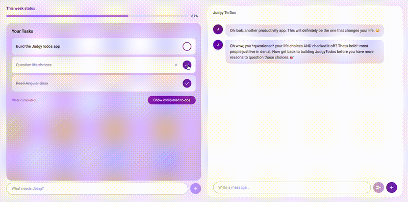
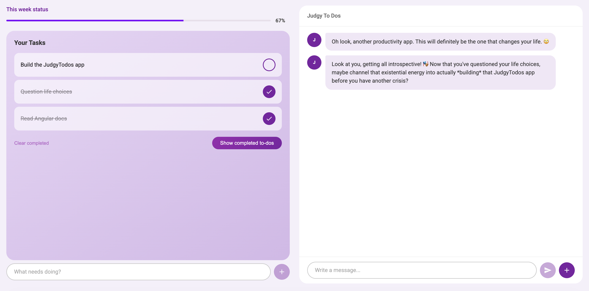
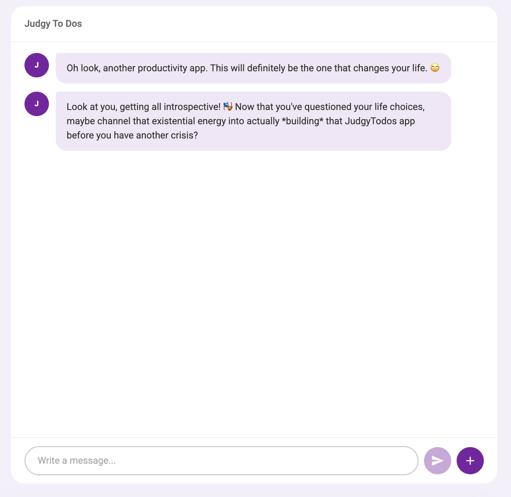
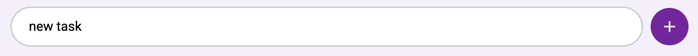

# JudgyTodo

> A todo app with an AI copilot that judges every single thing you do.

Add a task? It has opinions. Complete one after 3 days? It notices. Delete one you never started? Oh, it *definitely* notices.



---

## Screenshots

### Main View

<!-- Replace with your screenshot -->


### Judge Roasting You

<!-- Replace with your screenshot -->


### Adding a Task

<!-- Replace with your screenshot -->


---

## Tech Stack

- **Frontend:** Angular 21, Angular Material, Signals, RxJS
- **Backend:** Cloudflare Worker (API proxy to Anthropic Claude)
- **AI:** Claude via Anthropic API for sarcastic commentary
- **Testing:** Vitest

## Features

- Add, complete, and delete todos with priority levels
- AI judge sidebar that roasts your productivity in real time
- Chat with the judge — ask it anything
- Filter todos by status (All / Active / Completed)
- Progress stats with visual indicator
- Smart/dumb component architecture with OnPush change detection
- Signal-based state management

## Getting Started

### Prerequisites

- Node.js 18+
- Angular CLI (`npm install -g @angular/cli`)

### Install

```bash
git clone https://github.com/monik182/judgy-todo.git
cd judgy-todo
npm install
```

### Run the frontend

```bash
ng serve
```

Open [http://localhost:4200](http://localhost:4200).

### Run the API worker (for AI judge)

```bash
cd worker
npm install
npm run dev
```

## Project Structure

```
src/app/
├── app.ts                          # Root layout component
├── app.config.ts                   # App bootstrapping
├── app.routes.ts                   # Routes (lazy-loaded)
├── core/services/
│   └── judge.service.ts            # AI judge integration
├── features/
│   ├── todos/
│   │   ├── todo.component.ts       # Smart container
│   │   ├── todo-input.component.ts # Add task form
│   │   ├── todo-item.component.ts  # Single todo row
│   │   ├── todo-filters.component.ts
│   │   ├── todo-stats.component.ts
│   │   └── todo.service.ts         # Signal-based state
│   └── judge/
│       ├── judge-panel.component.ts
│       ├── judge-message.component.ts
│       └── judge-input.component.ts
└── shared/
    ├── pipes/time-ago.pipe.ts
    └── models/todo.model.ts

worker/                             # Cloudflare Worker API
└── src/index.ts
```

## Scripts

| Command | Description |
|---------|-------------|
| `npm start` | Start dev server |
| `npm run build` | Production build |
| `npm test` | Run unit tests |
| `cd worker && npm run dev` | Start API worker locally |
| `cd worker && npm run deploy` | Deploy worker to Cloudflare |

---

## Adding Screenshots

Create a `docs/` folder and add your images:

```
docs/
├── demo.gif
└── screenshots/
    ├── main-view.png
    ├── judge-panel.png
    ├── add-task.png
    └── mobile-view.png
```

Then the images in this README will render automatically.
